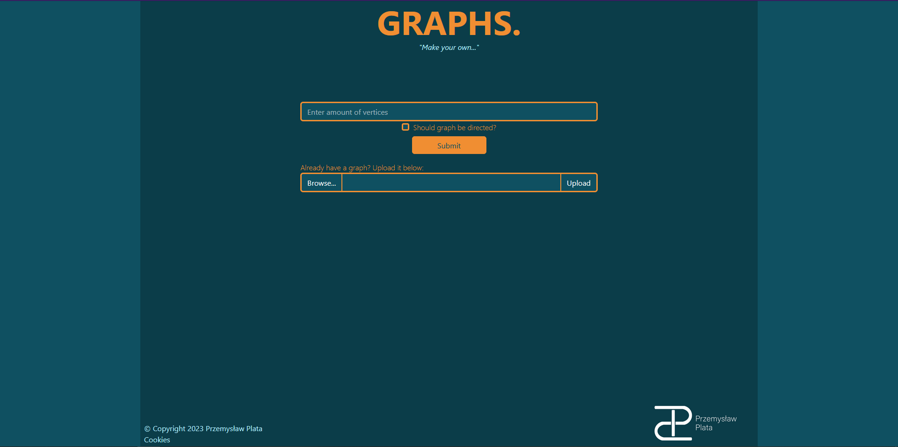
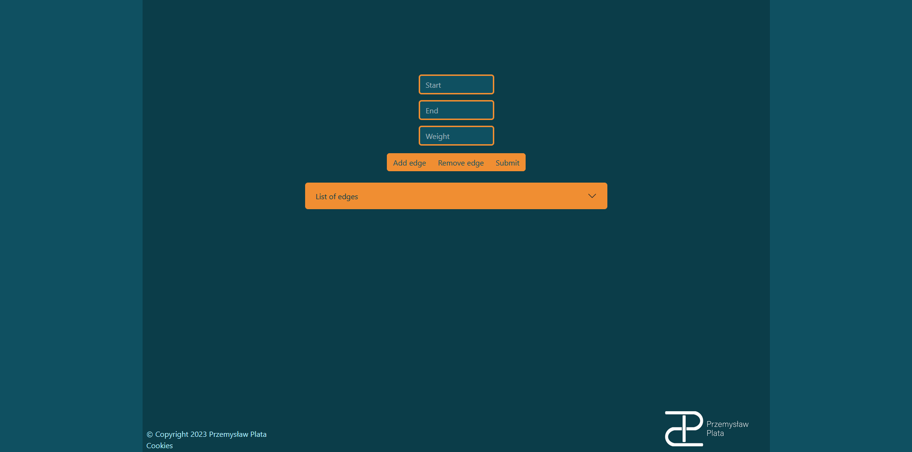
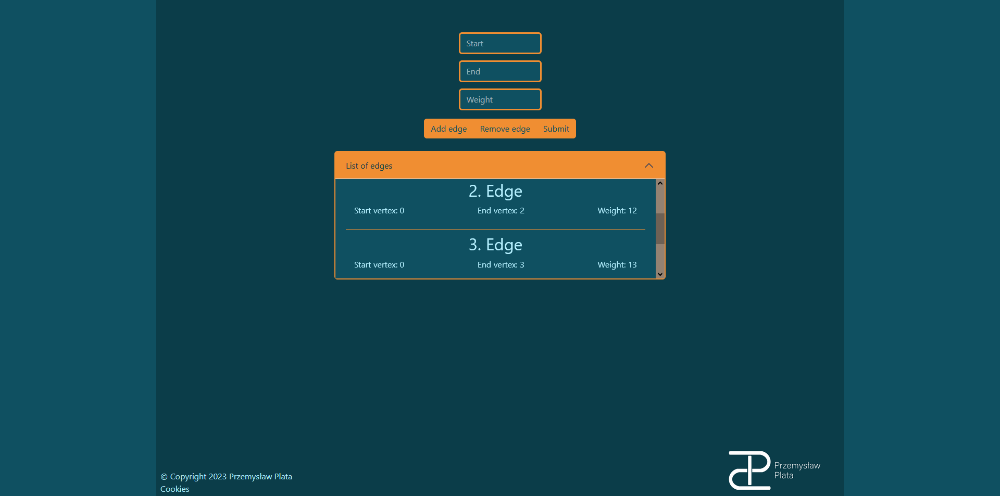
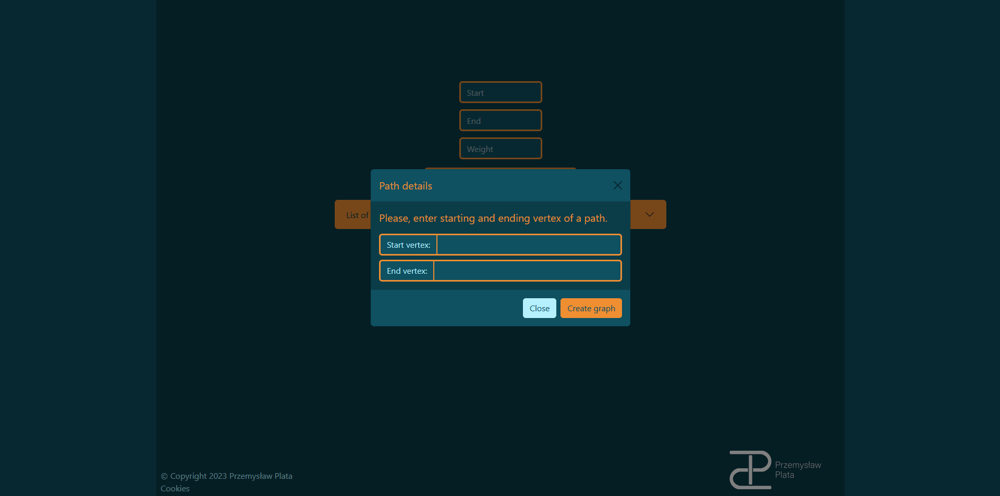
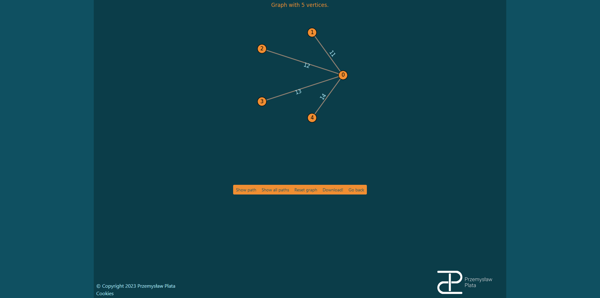

# PathFinder
Path Finder is a web app that allows to create a weighted graph and find a shortest path using Dijkstra Algorithm. You can find it running on https://pathfinder-l25n.onrender.com/.
The app uses python flask package for backend and js with bootstrap for frontend. Package that performs operations on graphs is called igraph.
# Overview
## Index page

On this page you can set the amount of the vertices in your graph and set whether it is directed. In addition to that, you can also upload a graph created on this website.
## Graph creation/modicifaction page

On this page you can create/modify your graph via given form. You can add/remove edges from a graph.

When you click on a button named 'list of edges' it, as the name says, shows a list of edges of the current graph.

After submitting the form, alert pops up. Now you can specify the starting vertex of a path and the final vertex of a path.
## Graph show page

On this page you can see the visualization of a graph. Button below allow to draw a path between specified vertcies or draw all possible paths from a starting vertex.
You can also download a .zip file with graph file and pdfs/jpgs showing the graph with and without drawn paths.
# Setting up PathFinder
If you want to set up a PathFinder locally you need to:
1. Download Python 3.7.9.
2. Open console in a folder with PathFinder and create a virtual environment.
```cmd
py -m venv env
```
3. Activate the virtual environment.
4. Install packages from requirements.txt.
```cmd
pip install -r requirements.txt
```
5. Start a flask server.
```
flask --app PathFinder run
```
You can add a 'debug' argument at the end to start a server in debug mode.
